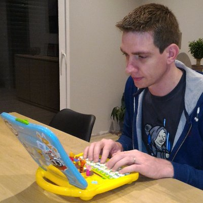

# Titre

## Cartouche d'identification

 - Manifestation : CodeursEnSeine 2019
 - Lieu : Kindarena Rouen -  40 Rue de Lillebonne, 76000 Rouen
 - Conférence : Comment j'ai arrêté les boucles for
 - Horaire de la conférence : 15h40 à 16h
 - Durée de la conférence : 20 minutes
 - Conférencier(s) :
   - Ghislain MAHIEUX [Twitter](https://twitter.com/GhislainMahieux)

 - Audience : 60 personnes
 - Auteur du billet : Emma Bonhomme
 - Mots-clés :
   - Langage fonctionnel
   - Fonctions
   - Boucles
   - Programmation
   - Code

## Support
 - [Lien vers le support présenté en conférence](https://docs.google.com/presentation/d/1zOQ2OD_J7VpqobgA4OhXW7yqw3S7_HCFoh1roEiotuY/edit#slide=id.g65a1ebabba_1_2335)
 - Nombre de diapos du support : 20
 - Plan du support :
   - Introduction
   - Vocabulaire spécifique
   - Présentation de Kotlin
   - Présentation de Arrow
   - Exemples d'utilisation
   - Conclusion

## Résumé
Pendant cette conférence Ghislain Mahieux aborde son expérience de développeur lors de son passage au développement en langage fonctionnelle.  
Avant ce changement il avait cette vision des langages fonctionnels :  
Un langage qu'il faut apprendre prendre en main, aux concepts abstraits, avec un vocabulaire complexe comme suit :  
  - Functor
  - Bifunctor
  - Monoid
  - Foldable
  - etc...
  
L'utilisation d'un langage fonctionnel pour développer ne l'attirait donc pas du tout.  

C'est son arrivée dans une nouvelle équipe qui lui a fait changer d'avis. Il explique sa transition du Java aux langages fonctionnels d'abord avec Kotlin et ensuite avec Arrow, mais aussi ce qui a motivé cette transition.  

### Kotlin
On pourrait croire que Kotlin est un langage réservé aux développeurs Android, pourtant ce langage est très bien en transition pour du développement fonctionnel. L'auteur qualifie Kotlin de la manière suivante : "Java aux amphétamines avec du fonctionnel dedans".  
En effet ce langage est intopérable avec le Java, immutable et a une "Null Safety".  
La transition se fait facilement car celui-ci n'a pas l'impression de faire du fonctionnel.

### Arrow
Ensuite Ghislain Mahieux a commencé à coder en Arrow. Selon lui c'est "Le compagnon fonctionnel de Kotlin" qui permet d'utiliser les concepts mathématiques du fonctionnel.

Finalement, Ghislain Mahieux a montré des exemples concrets de code en Java 8 puis Kotlin. Le but est donc de mettre en évidence les avantages du Kotlin face au Java.  
On voit donc qu'avec Kotlin on effectue les mêmes méthodes mais celles-ci sont beaucoup moins verbeuses. Le code est plus lisible, il est donc plus facile d'amener de la complexité.

Pour conclure les conseils de Ghislain Mahieux pour une transition vers le fonctionnel réussie :  
  - Pas de "Big Bang" : Il faut y aller petit à petit
  - Laisser la théorie de côté
  - La programmation fonctionnelle sert le code, non pas l'inverse
  - Prendre le temps de découvrir les bénéfices.

## Architecture et facteur qualité
Le conférencier nous décrit pendant sa présentation le langage fonctionnel avec les avantages suivant :  
  - Lisibilité : Un code conçis avec Extensions functions
  - Fiabilité : Plus de "Null pointer Exception", moins de code donc moins de Bugs
  - Maintenabilité : Avec les "Sealed Class" et Extensions functions
  - Progressivité : Migration de la codeBase au fur et à mesure.
 
 On peut en déduire que le facteur qualité principal est : **Maintenabilité** du à la simplicité du code, le fait que le code soit conçis. On minimise donc l'effort pour localiser et corriger les erreurs.
